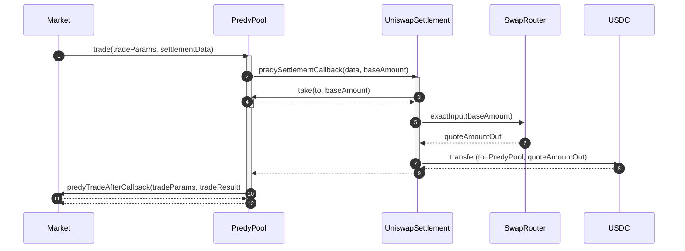
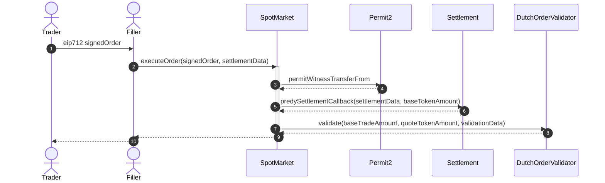

predyx
=====


## Overview

TBD

## Development

```
# Installing dependencies
forge install

# Testing
forge test
```


## Architecture

This project centers around 1 key smart contract and three types of smart contracts: PredyPool, Settlement, Market, and Order Validator.
The Settlement contract defines how to swap tokens, while the Market and Order Validator contracts define financial products and order types.
Markets can leverage positions by utilizing PredyPool for token lending and borrowing. 

This architecture is very scalable. For example, developers can create new futures exchanges with minimal code. Specifically, they gain leverage by connecting to PredyPool. By leveraging existing settlement contracts, they can access many liquidity sources and support multiple order types through order validators.

### PredyPool.sol

Short ETH(Base token) flow.



### PerpMarket.sol

Limit order flow of PerpMarket.


### SpotMarket.sol

Market order flow of SpotMarket.


